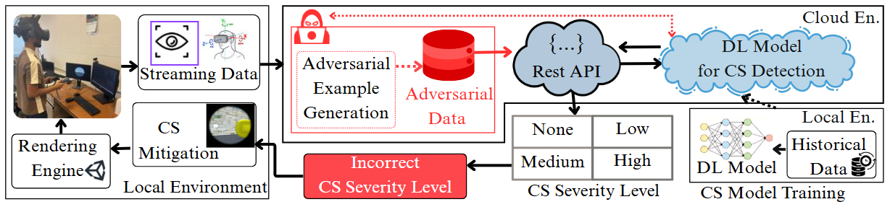

# Adversarial VR: An Open-Source Testbed for Evaluating Adversarial Robustness of VR Cybersickness Detection and Mitigation

<p align="center">
  
</p>

**Adversarial-VR** is a real-time VR testbed for evaluating deep learning (DL)-based cybersickness detection and mitigation strategies under adversarial conditions. It integrates:
- A **Python Flask backend** for deep learning-based cybersickness detection and adversarial attack generation  
- A **Unity-based VR maze frontend** for real-time simulation, sensor data collection, and adaptive mitigation

## Table of Contents
* [Introduction](#introduction)
* [System Overview](#system-overview)
* [Experimental Data & Models](#experimental-data--models)
* [Backend: Flask API](#backend-flask-api)
* [Frontend: Unity VR](#frontend-unity-vr)
* [Builds & Setup](#builds--setup)
* [Tool Usage](#tool-usage)
* [Contacts](#contacts)
* [License](#license)
* [Acknowledgements](#acknowledgements)
* [Known Issues](#known-issues)

---

## Introduction

Adversarial-VR  is a real-time VR testbed for evaluating DL-based automatic cybersickness detection and mitigation strategies under adversarial attack conditions. The backend hosts a DL model which is trained on the [MazeSick Dataset](https://ieeexplore.ieee.org/abstract/document/10985746), exposes a REST API for severity prediction, and supports three state-of-the-art adversarial attacks (MI-FGSM, PGD, C&W). The Unity frontend streams VR sensor data (e.g., eye tracking and head tracking), receives cybersickness severity prediction (e.g., none, low, medium, and high), and applies an automatic cybersickness mitigation technique (e.g., dynamic field of view).

---

## System Overview

- **Backend:** Python Flask server with a trained .keras DL model for cybersickness severity classification. Supports adversarial perturbation of inputs.
- **Frontend:** Unity VR maze simulation (PCVR/Android), real-time eye/head tracking, dynamic vignette mitigation based on backend prediction.
- **Hardware:** HTC Vive Pro Eye (recommended for full feature support).
- **Dataset:** Trained using MazeSick (open-source, see below).


## Experimental Data & Models

- **Model Training Data:** [MazeSick Dataset](https://ieeexplore.ieee.org/abstract/document/10985746).  
  Request access or see the publication for download instructions.
- **Trained Model:** Provided as `.keras` file (e.g, Transformer model).
- **Feature List:** See code and paper; ensure you maintain order and normalization.

---

## Backend: Flask API

### Features

- **REST API** `/predict`: Accepts feature vector (e.g., eye and head tracking features) and returns cybersickness severity (None, Low, Medium, High).
- **Adversarial Modes:** Switchable attacks using [CleverHans](https://github.com/cleverhans-lab/cleverhans):
  - MI-FGSM, PGD, C&W (edit code to enable/disable each).
- **Trained Model:** Loads `.keras` model.

### Setup

```bash
# 1. Create environment
python3 -m venv venv
source venv/bin/activate          # or venv\Scripts\activate on Windows

# 2. Install dependencies
pip install -r requirements.txt   # includes Flask, TensorFlow, CleverHans, h5py

# 3. Place your model file:
# model/Transformer.keras

# 4. Run Flask API
python AdversarialAttack.py
````

API runs by default at `http://localhost:8000/predict`

### Example Request

```json
POST /predict
{
  "Left_Eye_Openness": ...,
  "Right_Eye_Openness": ...,
  ...
  "Velocity": ...
}
```

Returns: predicted class, confidence, adversarial class/confidence (if enabled).

### Switching Attack Mode

* Edit `AdversarialAttack.py` and comment/uncomment the adversarial attack line you want (MI-FGSM, PGD, C\&W).
* Restart the Flask server for change to take effect.

---

## Frontend: Unity VR

### Features

* **Maze simulation** with coin collection, first-person movement.
* **Real-time streaming** of eye/head tracking data to Flask backend.
* **Automatic mitigation:** Dynamic field-of-view ("tunneling vignette") that narrows FOV based on model's predicted severity.
* **Visual indicators** for severity class, coin count, and vignette effect.

### Prerequisites

* **Unity 2020.3 LTS** or newer
* **HTC Vive Pro Eye** (or compatible with eye/head tracking)
* **SRanipal SDK** and **Tobii Vive SDK** imported to project
* **Unity XR plugin**

<!-- ### Android Build (if adapting for mobile):

* Install Android Build Support in Unity
* Adapt VR/XR input and eye-tracking code to your platform (Quest SDK, etc.) -->

### Integration Steps

1. Import SRanipal & Tobii SDKs, set up eye/head tracking scripts.
2. Import the Tunneling Vignette component and custom controller script.
3. Implement a script for streaming feature vectors to the backend (`UnityWebRequest`).
4. Update the vignette parameters in real time according to backend predictions (mapping severity levels to aperture/feather, see paper/Table 2).
5. Set backend URL in your Unity client scripts.

---

## Builds & Setup

### Backend

* See [Backend Setup](#backend-flask-api) for creating environment and running server.

### Frontend

* Open Unity project, ensure dependencies above are imported.
* Set backend URL for prediction.
* Build for PCVR (default) or Android (with adaptation).

---

## Tool Usage

1. **Start Flask API** (`python AdversarialAttack.py`).
2. **Play in Unity**: The system streams real-time sensor data to backend, applies mitigation automatically.
3. **Enable Attacks:** Change adversarial mode in backend as needed, observe Unity response.

---

<!-- ## Citation

If you use Adversarial-VR in your research, please cite:

```bibtex
@inproceedings{ahmed2025adversarialvr,
  author    = {Istiak Ahmed and Ripan Kumar Kundu and Khaza Anuarul Hoque},
  title     = {Adversarial VR: An Open-Source Testbed for Evaluating Adversarial Robustness of VR Cybersickness Detection and Mitigation},
  booktitle = {ISMAR TRUSTXR 2025},
  year      = {2025}
}
```

--- -->

## Contacts

<!-- Maintained by [Istiak Ahmed](mailto:ia5qq@umsystem.edu), [Ripan Kumar Kundu](mailto:rkcgc@umsystem.edu), and [Khaza Anuarul Hoque](mailto:hoquek@missouri.edu). -->
Maintained by [Khaza Anuarul Hoque](mailto:hoquek@missouri.edu).

---

## License

MIT License

---

## Acknowledgements

* [MazeSick Dataset](https://ieeexplore.ieee.org/abstract/document/10985746)
* CleverHans adversarial attack library
* Unity Tunneling Vignette ([based on Fernandes & Feiner, 2016](https://ieeexplore.ieee.org/abstract/document/7460053)) 
* HTC SRanipal, Tobii, and Unity XR SDKs

---

## Known Issues

* Android/mobile VR support may require extra development and custom eye-tracking code.
* Flask backend and Unity must be able to communicate over network; ensure firewall/port settings.
* Some adversarial attacks (esp. C\&W) are computationally expensive and may add response delay.


